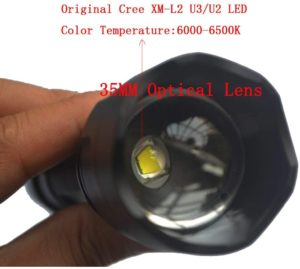

# Handheld Light Graffiti Projector Tutorial

**Notes about this repository**: To help with creating stencils for your projector, we have provided both .pdf files for [printing transparencies](https://github.com/DisruptivelyUseful/handheld-light-graffiti/tree/master/transparency-stencil-files) and .svg files for [laser cutting acrylic or wood stencils](https://github.com/DisruptivelyUseful/handheld-light-graffiti/tree/master/lasercut-stencil-files) in the correct size for the flashlight that we link to in this tutorial. You may need to resize the stencils for your flashlight if it is a different size. 

# Handheld Light Graffiti Projector Tutorial

Hi, we are based in Portland, OR and we are here to help you build a handheld light projector from relatively accessible hardware store parts. If you scroll down this page a bit you will find TONS of additional detail on how to build this projector.

If you follow our suggestions of what to buy and use the links we provide here, this should cost around $45-50 in materials, (cheaper if you find used parts on your own).

PLEASE NOTE: We have worked hard to give details for the specific build we know works, but hope that people will also try to design similar, not exact copies. This is because A) The exact parts needed for this build may be difficult to source in the future, though similar parts should always be available and B) Alternate builds could quite possibly have advantages of their own, such as lowering cost or improving projection throw.

This project is also completely open source, meaning that you can make, share, use, alter, and yes, even sell this design or any similar design, with no credit or attribution needed. This information is yours. 

Please watch this [tutorial video first](http://www.disruptivelyuseful.org/)

Really all you need is:

- [a fairly powerful LED flashlight](https://www.amazon.com/Supfire-Tactical-Flashlight-Water-proof-Included/dp/B07FBJBZ25/) (if that is out of stock please use [this](https://www.amazon.com/HEHEMM-Flashlight-Basement-Activities-flashlight/dp/B01LYNAAZP) or [this](https://www.amazon.com/LED-Tactical-Flashlight-Emergency-Torch/dp/B016449PHY/ref=sr_1_79?dchild=1&keywords=ultrafire+c8+18650+flashlight&qid=1591563889&sr=8-79https://www.amazon.com/HEHEMM-Super-bright-Lumens-Flashlight-Controlled/dp/B01LX7WXYX/ref=psdc_2445457011_t4_B01LYNAAZP). We will try hard to update with what works regularly.)
- [a lens*](https://www.ebay.com/sch/i.html?_from=R40&_trksid=m570.l1313&_nkw=projection+television+lens&_sacat=0)
- [a stencil*](https://github.com/DisruptivelyUseful/handheld-light-graffiti/tree/master/stencil-svg-files)
- [a way to couple it all](https://www.amazon.com/Fernco-P1056-415-Flexible-Coupling-4-Inch/dp/B000I1AVCS/ref=sr_1_29?crid=25XW03K529JES&dchild=1&keywords=fernco+coupling+1+1%2F2&qid=1591568700&sprefix=fernco%2Caps%2C223&sr=8-29)

The items linked here are the ones we used in the tutorial video, if you want to make that exact build.*

*Important details on the lens and stencil are available slightly down this page, in their sections.

What you are doing in this project, essentially, is sending a flashlight beam farther and more sharply with a lens then it can do on it’s own. Then you are adding a message with the stencil. The coupling is all about finding the focus, the spacing between the flashlight and lens. There could be a thousand creative ways to do this build and we try to talk about that in this tutorial. We also give you specifics on what has worked for us in the linked list above, the video, and in the information below.

Please watch the video for an overview of how things fit together.

## Flashlight Tip and Resources:

**FLASHLIGHT TIPS:**

Any light source can work, but LED flashlights are the cheapest, smallest, safest option as they don’t produce a lot of heat that could melt or ignite your stencil.

In this build, we used a 1000 lumin "tactical" flashlight that we got on Amazon a few years ago for around $20. The brighter the better, but a 1000 lumen rated flashlight with a fresh 18650 battery can throw a remarkably large and clear image in reasonable darkness. We have found essentially the same flashlight from a different supplier since then, and link to flashlights we know work at the bottom of this section.

Speaking of batteries, the flashlights that use rechargeable lithium “18650” style batteries are a great option, because 6-8 useable 18650 cells can be recovered from old laptop batteries, and a single 18650 can power one of these flashlights for 4-7 hours. It’s ok if it uses regular batteries too.

You will probably want extra batteries on you to last the night, so having a 18650 battery charger and extra reachargeable 18650 batteries is a really great investment. These are easily found online.

It doesn’t matter so much which brand of flashlight you use, but we learned the hard way that some LED flashlights use a parabolic reflector to focus the light, and some use a plastic lens. Both work fine for use as a flashlight, but for use as a projector the ones with parabolic reflectors work WAY better, because they hold the stencil much further away from the hot LED and because they don’t complicate the optics. 

The ones with reflectors (good!) look like this:

Not this:

The head of the flashlight we used fits perfectly into a 1.5” plumbing fitting, designed for ABS pipe, which made coupling it to the lens easy. The flashlight we currently suggest is [this one](https://www.amazon.com/Supfire-Tactical-Flashlight-Water-proof-Included/dp/B07FBJBZ25/), which comes with an extra 18650 battery and battery charger.

**FLASHLIGHT RESOURCES:**

- [Flashlight we recommend](https://www.amazon.com/Supfire-Tactical-Flashlight-Water-proof-Included/dp/B07FBJBZ25/) (if that is out of stock please use [this](https://www.amazon.com/HEHEMM-Flashlight-Basement-Activities-flashlight/dp/B01LYNAAZP) or [this](https://www.amazon.com/LED-Tactical-Flashlight-Emergency-Torch/dp/B016449PHY/ref=sr_1_79?dchild=1&keywords=ultrafire+c8+18650+flashlight&qid=1591563889&sr=8-79https://www.amazon.com/HEHEMM-Super-bright-Lumens-Flashlight-Controlled/dp/B01LX7WXYX/ref=psdc_2445457011_t4_B01LYNAAZP). We will try hard to update with what works regularly.)

- If you have the funds, you can buy a [professional gobo projector](https://www.google.com/search?q=gobo+projector&rlz=1C5CHFA_enUS839US839&sxsrf=ALeKk02kNfq3QnQ5u8XuZQiBq0yiBY5QMg:1591572177599&source=lnms&tbm=shop&sa=X&ved=2ahUKEwiPuJ6y7PDpAhUCvZ4KHeW4CuEQ_AUoAXoECAsQAw&biw=1280&bih=596)

## Stencil Tips and Resources:

**STENCIL TIPS:**

This style of projection is called “gobo” projection. “Gobo” stands for “Goes before optics” because putting a stencil between a light and a lens projects a crisp, focused image. A stencil used for projection like this is sometimes referred to as [“a gobo”.](https://en.wikipedia.org/wiki/Gobo_(lighting)) and can be made of clear acetate sheet, acrylic, wood or metal (depending on how hot your light source gets)

You’ll need to be able to make stencils to throw your own images. We used a Glowforge(https://glowforge.com/) basic 40W laser cutter to cut thin (1/16th”) black acrylic for our stencils, which worked well with the 1000 lumin flashlight we suggest. We made a round stencil at 1.61" diameter because that is what fits inside the head of the flashlight we use. We have provided these .svg files [in this repo](https://github.com/DisruptivelyUseful/handheld-light-graffiti/tree/master/stencil-svg-files) for you to use. If you don't have a laser cutter you could ask your local makerspace, or use an online lasercutting service like [Ponoko.](https://www.ponoko.com/). 

Another, potentially more accessible way of creating stencils is by [printing transparencies](https://github.com/DisruptivelyUseful/handheld-light-graffiti/tree/master/transparency-stencil-files), which we have also provided files for.

If you don’t have access to a laser cutter or printer you can experiement with making your own stencils using different materials, like thin plastic, stiff card stock, or even a tin can and an exacto knife.

We are also offering (at this time) to lasercut an acrylic stencil, for free, for anyone who is trying to make their own projector. We know it can be difficult to get this part done, and we would like to help you. Please email us at DisruptivelyUseful@gmail.com

Cut out stencils work best for larger words and simple phrases. For smaller/more text, we found that laser engraving an image onto CLEAR acrylic and then spray painting the engraved area black before peeling off the protective paper worked surprisingly well, actually. It may be worth playing around with that approach if you DO have access to a laser cutter.

Get creative! And let us know what works well for you!

**SAFETY TIP**: Test your stencil out before-hand and make sure it isn’t getting too hot!

**STENCIL RESOURCES**

- [We have added .svg files to this repo for lasercutting](https://github.com/DisruptivelyUseful/handheld-light-graffiti/tree/master/stencil-svg-files)
- [We have added .pdf files to this repo for printing transparencies](https://github.com/DisruptivelyUseful/handheld-light-graffiti/tree/master/transparency-stencil-files)
- If you do not own a lasercutter you can ask your local makerspace to help
- You can also use a custom online lasercutting service like [Ponoko.](https://www.ponoko.com/)
- Or, email us at DisruptivelyUseful@gmail.com and we'll mail you a few free stencils. 
- Here’s a tutorial on a [low-tech DIY metal gobo](https://www.instructables.com/id/Home-made-Gobos/) from a tin can/pie plate
- You could draw on a sheet of transparent plastic with a sharpie
- You could cut a stencil out of cardboard with a razor blade, and add tinfoil if it’s getting hot
- You could [3D print a stencil](https://www.thingiverse.com/search?q=stencil&type=things&sort=relevant)

## Lens Tips and Resources:

**LENS TIPS:**

Nearly any lens of any kind will work, but some will work (much) better than others. All lenses have a focal length- the distance from the lens where the image comes into focus. We used a lens from an old big screen TV, because we had a few lying around. They work well, and 3 of them can be found inside any old boxy projection-style TV. (If you are unsure if a TV is the right kind, try gently poking the screen. Is it large, plastic, textured, and a little floppy in the middle? If so, you’re in luck!) Also note that the Fresnel lens and first surface mirror in big screen TVs can be used to make solar concentrators and other fun optical projects, but that's for a different tutorial.  

If you take off the screen, it should look something like this:

Not everyone wants to rip apart a big screen TV, however, so we did some research and found that you can buy this style of lens on ebay for $5-$20. You want to search for "projection television lens", and look for a lens that looks like this:

Each lens comes in two parts: the lens assembly, and a plastic housing that slides along two screws, allowing for fine adjustment of focus. For our purposes, we won’t need the outer housing. Just unscrew the two screw posts and pull the lens away from the housing, like this:

The lens assembly has a stepped shape that makes it easy to find a step with the right diameter to couple to a plumbing fitting. We found that the second step on ours was almost exactly 4″, and fit a 4" FERNCO ABS pipe plumbing fitting*.

*Check out the coupler section below for details.

### CAMERA LENSES:

In our understanding other optics (lenses) can work well, though we have not played with other lenses much so far. Old 35 mm camera lenses can usually be found at thrift stores for $5-15, and they have very high quality optics, and many of the bigger telephoto-style ones will let you make very fine adjustments to the focus and size/throw of your image.

The now-defunct [GuerillaBeam project](https://streettoolbox.fandom.com/wiki/Guerilla_Beam) used a 3D printed slide holder to couple 35MM camera lenses to LED flashlights, which is how we know they work. If you use a camera lens, you’ll have to play around with the spacing between the light, stencil, and lens to find the sweet spot, and then design your coupler accordingly.

**SAFETY TIP**: To be safe, NEVER LEAVE A BIG SCREEN TV LENS OUT IN THE SUN, it can act as a giant magnifying glass and light things on fire when the sun hits it.

**LENS RESOURCES:**

- Search for "projection television lens" on [Ebay](https://www.ebay.com/sch/i.html?_from=R40&_trksid=m570.l1313&_nkw=projection+television+lens&_sacat=0) to find a similar lens to the one we used in this tutorial for around $10.
- Ask around for old TV lenses and camera lenses
- Check thrift shops and re-stores.

## Coupler Tips and Resources:

**COUPLER TIPS:**

The coupler can be anything that securely holds the flashlight to the lens, and allows you to make small adjustments to the focus. We used a 1.5”x4” rubber FERNCO ABS pipe plumbing fitting, which happened to fit our lens on one end and flashlight on the other, and these should be available at any large hardware store. 

These kinds of fittings come in a wide range of sizes, and are a good, cheap, widely available option for connecting things together. Source your flashlight and lens first, and then find your coupler to match them. The distance between the lens and the stencil is more important than the distance between the light source and the stencil. Find the focal length by simply holding your lens in front of your stencil/flashlight and then source your coupler accordingly.

Since the coupling is all about attaching the flashlight to the lens with the correct distance between them to focus, we think a number of other things could work for this, though we haven't personally tried.

**GuerrillaBeam Coupling**

The now-defunct [GuerillaBeam project](https://streettoolbox.fandom.com/wiki/Guerilla_Beam) is a 3D printed slide holder AKA a coupling meant for a flashlight on one end and a 35mm camera lens on the other end. A number of adaptations have been make and a lot of these 3D printing files can be found when you search "guerillabeam" on [Thingiverse](https://www.thingiverse.com/search?q=guerillabeam&type=things&sort=relevant). 

**Crafty Coupling**

We are pretty sure you could use materials such as cardboard, tape, hot glue, foam, toilet paper tubes, pool noodles etc to figure out a coupling for your flashlight and lens if you want to get creative with cheap supplies.

**COUPLER RESOURCES:**

- [1.5x4” FERNCO coupler](https://www.amazon.com/Fernco-P1056-415-Flexible-Coupling-4-Inch/dp/B000I1AVCS/ref=sr_1_29?crid=25XW03K529JES&dchild=1&keywords=fernco+coupling+1+1%2F2&qid=1591568700&sprefix=fernco%2Caps%2C223&sr=8-29)
- This part could be crafty, like some stiff cardboard and tape
- Or it could be a [3D printed part](https://www.thingiverse.com/search?q=stencil&type=things&sort=relevant) custom fitted to your flashlight and lens

## OTHER NEAT RESOURCES:

- Beautiful Rising on [Guerilla Projection as a protest tactic](https://beautifulrising.org/tool/guerrilla-projection)

- [The Illuminator Collective](http://theilluminator.org/) have been light projection activists since 2012 and make tutorials

- [Overpass Light Brigade](https://www.facebook.com/OverpassLightBrigade/)

- You can follow us, the creators, if you would like. Here's Claire's [social links and other open source resources](https://linktr.ee/ClaireDanielleCassidy), and here's Sam's [website.](http://www.samsmith.work/) 

### “This technology is very powerful, “spectacular” in nature, and often under the control of one person or a small group who could potentially manipulate a large and impressionable crowd. This power needs to be kept accountable to the broader group, and should be wielded with great care.” 
### – [Beautiful Rising on Guerrilla Projection](https://beautifulrising.org/tool/guerrilla-projection)

